<h1 align="center">Hi there 👋, I'm Rajat Singhariya</h1>
<h3 align="center">Full-Stack Software Engineer & AI Integrator 🚀</h3>

  
  
  
  
  

---

### 💻 Core Focus & Engineering
- 🚀 Building scalable full-stack web applications, REST APIs, and robust backend architectures.
- 🤖 Integrating real-world LLM capabilities (Claude & Gemini APIs) and geo-spatial features into web workflows.
- ⚡ Focused on clean code, system design, and shipping production-ready software solutions.
- 🎓 B.Tech CSE @ JIET Jodhpur (2023–2027) | IEI Chapter
- 💼 Ex-PHP Development Engineer Intern @ Lucid Outsourcing Solutions | Open to new internships & opportunities
- 🔗 Interactive Portfolio: **[rajatsinghania-portfolio.vercel.app](https://rajatsinghania-portfolio.vercel.app/)**

---

### 🛠️ Tech Stack & Ecosystem

- **Languages:**  JavaScript (ES6), Python
- **Frontend:**  React.js, Tailwind CSS, Bootstrap, HTML5, CSS3, jQuery
- **Backend:**  Node.js, Express.js, PHP, Laravel 12, REST APIs, JWT Auth
- **Databases:**  MySQL, MongoDB, PostgreSQL, PDO
- **Tools & DevOps:**  Git, GitHub, Docker, Cursor, VS Code, Postman

---

### 🚀 Flagship Projects

| Project Name | Tech Stack | Description | Live / Source |
| :--- | :--- | :--- | :--- |
| **Ordo** | Full-Stack, Laravel, AI Integration, Geo-Spatial | Task management platform combining AI-assisted task creation (Gemini API), geo-spatial features (Leaflet.js), and role-based access control. | [Live Demo](https://ordo-production-8254.up.railway.app) / [GitHub](https://github.com/Rajatsinghariya654/ordo) |
| **LexBot** | Node.js, Express, MongoDB, Claude & Gemini APIs | AI legal Q&A chatbot for real-time chat with persistent session history across REST endpoints, used by 100+ users. | [Live Demo](https://lexbot-hj2h.onrender.com/) / [GitHub](https://github.com/rajat-singhariya/LexBot) |
| **Grocery Finance System** | Full-Stack, AI Analytics, MySQL, RBAC | Role-based order management system featuring an AI-driven demand prediction and anomaly detection dashboard. | [Live Demo](https://grocery-finance-system.onrender.com) / [GitHub](https://github.com/rajat-singhariya/grocery-finance-system) |
| **EduInsight** | REST API, Node.js, Backend Architecture | Role-based school management backend with 15+ API endpoints and analytics summaries for student and class performances. | [Live Demo](https://eduinsight-taupe.vercel.app) / [GitHub](https://github.com/rajat-singhariya/eduInsight) |
| **Vehicle For You** | PHP 8, MySQL, OOP, PDO, AJAX | Vehicle rental app featuring an OOP model layer, abstract vehicle base classes, factory pattern, public booking flow, and an admin panel. | [GitHub](https://github.com/rajat-singhariya/vehicle-for-you) |

---

### 🏆 Achievements

- Selected for **HackSecure X International**
- Selected for **RECKON 4.0**
- Student Secretary, **IEI Chapter** — JIET Jodhpur

---

### 📈 GitHub Metrics & Trophies

  

  

  
  

---

### 🐍 Contribution Snake Animation

  <picture>
    <source media="(prefers-color-scheme: dark)" srcset="https://raw.githubusercontent.com/rajat-singhariya/rajat-singhariya/output/github-contribution-grid-snake.svg">
    
  </picture>

<i>Open to internships, freelance work, and collaborative opportunities. Feel free to reach out!</i>

---
